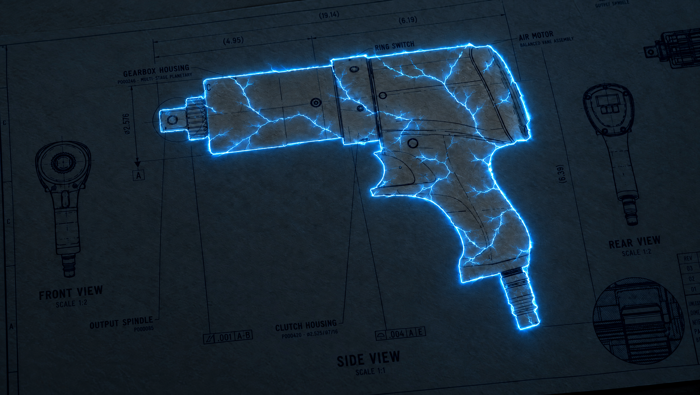
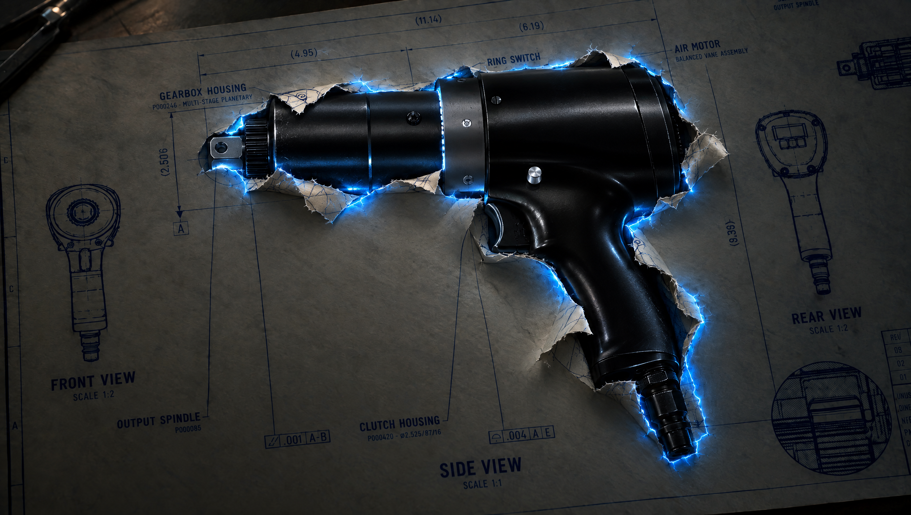
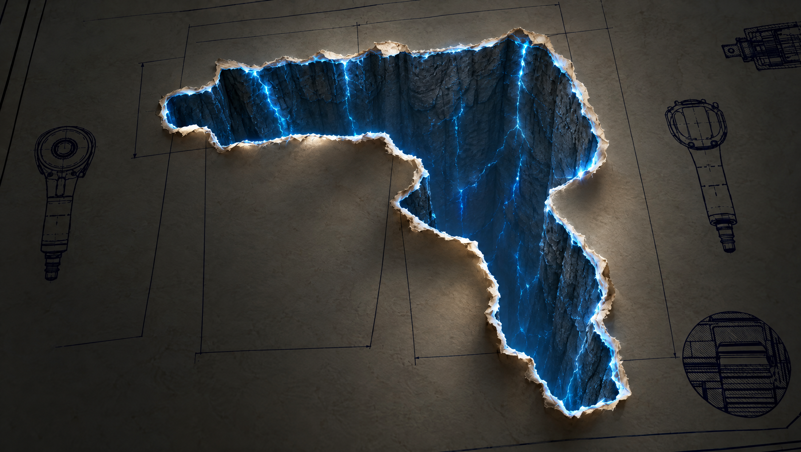

# JG-035 — Feedback re-render for approval

2026-10-03. Status: three revised stills generated and inspected; owner approval OPEN. Appearance studies only. No application source changes.

## Feedback applied

Reviewed `../02-first-rupture-v2-feedback.png` and `../03-deep-tunnel-feedback.png`. A repository-wide filename search found these two marked-up images; no third feedback image was found. The intact-paper frame therefore follows the written direction and prior concept, with an asynchronous location question left for the owner.

Owner timing is now settled: the actual J-Gun pushes up and breaks the paper at first rupture. The cavernous shaft becomes visible only after the model elevates enough to reveal it. The prior review's emergence-timing question is superseded.

The remaining opening must read as a near-vertical extrusion of the torn-paper outline, with indefinite depth, light-blue wall fissures, no bottom, no pocket/terraces and no copied circular spindle hole or splined collar inside the shaft.

## Revised stills

1. `01-paper-webbing.png`: intact paper, light-blue branching trace/webbing, removed upper-left pen and warm reflection. No cavity yet. Local emissive spill still makes paper around the blue lines brighter; this is a concept, not a measured luminance gate.
2. `02-model-first-rupture.png`: black metal J-Gun physically occupies the rupture and pushes printed paper flaps outward. No exposed cavern. Used both the owner's annotated rupture and actual production model capture `../../../portal-correction-2026-10-02/production-capture/desktop/t-0_865.png`. The model is broadly visible at this instant; final animation should retain progressive upward tearing rather than instantly pop to this pose.
3. `03-vertical-shaft.png`: sheer near-vertical rocky walls track the torn outline and descend out of sight; no visible floor, boulder-filled pocket, mechanical hole or splined collar. Model has risen clear/out of frame. Exact depth and silhouette fidelity remain implementation/runtime verification work.

All three generated with the live `gpt_image_2_5` schema, high quality, 2k, 16:9. Completed job records and exact prompts are saved alongside the PNGs. The shaft's initial local-reference submission returned a no-response error; explicit reference upload and retry completed successfully.

Generated text and small dimensional details are not authoritative drawing assets. Approval concerns staging, material and wall direction; implementation must retain actual CAD and drawing data.

