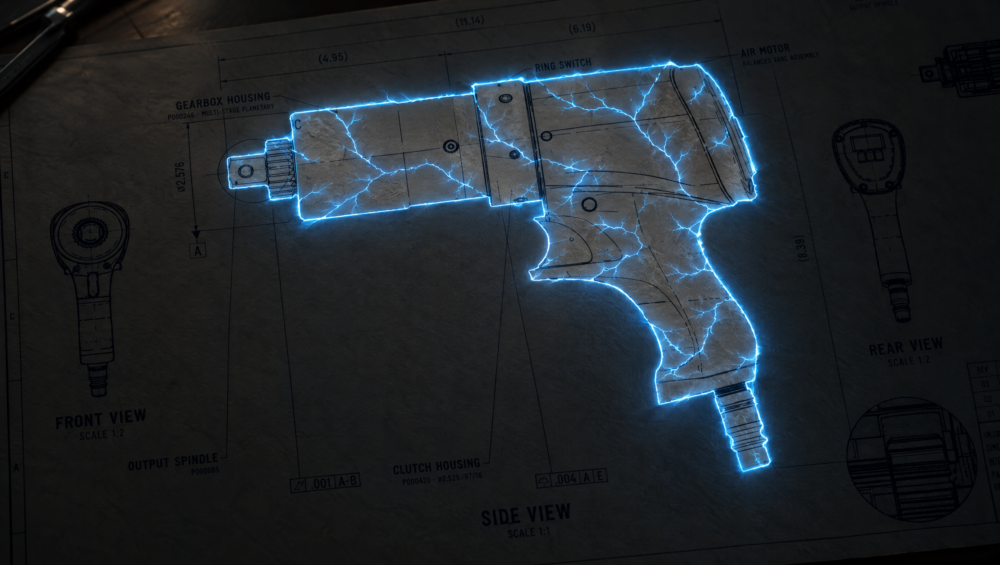
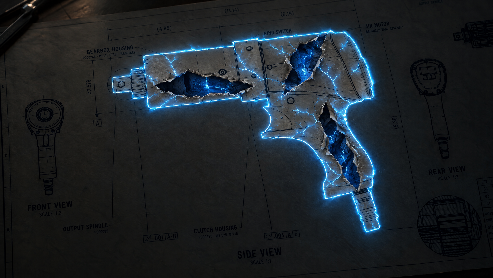
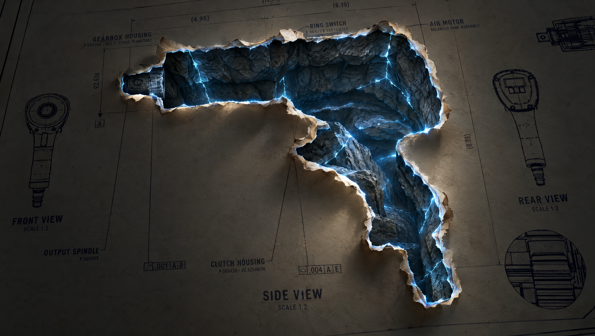

# JG-035 blue trace / rock tunnel — concept review

2026-10-03. Initial concept packet; superseded by `feedback-rerender/review.md` after owner markup. Emergence timing is now settled: model breaks through first, shaft is revealed after model rises clear. Revised visual approval remains OPEN. No application source changes, commit, push or deployment.

Generated with Higgsfield CLI 1.1.26, live `gpt_image_2_5` schema, 16:9, 2k, high quality. All four generation records report completed. Saved PNGs are 2688 x 1520. Each `.job.json` retains the prompt, request ID and hosted result URL; matching `.prompt.txt` records are beside the media.

Reference: `../../portal-correction-2026-10-02/dev-capture/desktop/t-0_72.png`. Reused the actual drawing composition and silhouette rather than inventing a generic portal.

## Proposed sequence

1. **Intact paper with blue trace/webbing** — `01-paper-webbing.png`. Branching blue energy, printed paper inside the profile, no white emissive fill. Visual limitation: blue spill makes the profile paper locally brighter; incidental warm highlight remains at the upper-left desk edge. Implementation must measure stock luminance separately from emissive lines and exclude ambient lamp light.
2. **First interior rupture** — `02-first-rupture-v2.png`. Three tears within the profile expose blue-veined rock; surrounding sheet stays intact. This replaces v1, which incorrectly tore around a bright intact paper tool cutout. V1 remains retained as rejected generation evidence.
3. **Opened rock tunnel** — `03-deep-tunnel.png`. Irregular rock walls and matching blue fissures replace the planar background. Useful material and doorway direction; perceived depth remains an owner judgment. The wall layering is visible, but this generated view does not prove an infinitely deep or occluded continuation. Build should bend the passage out of sight and prevent any planar terminator.

These are generated appearance studies, not CAD-accurate geometry, final color authority, approved timing or runtime verification. Printed text/part numbers have generation distortions and must never replace actual drawing assets. No video was generated; the handoff permits stills and/or video.

## Owner decisions required

- Approve or revise the light-blue webbing and rock-tunnel visual direction.
- Choose metal visibility at first rupture: blue-lit metal immediately beneath the tears, or metal reveal after the rupture beat. Stills deliberately do not settle this causal/timing decision.

The required implementation boundary is the owner's handoff: “Do NOT begin implementation until Mark approves the concept.”

## Generation recovery

Initial local-reference/standard-input submission returned `request failed (no response received)` with no job output. Explicit reference upload succeeded; retry with uploaded reference ID and explicit prompt succeeded. The rupture correction reused the first completed concept as its image reference. No credentials or authentication tokens were recorded.

## Review images

