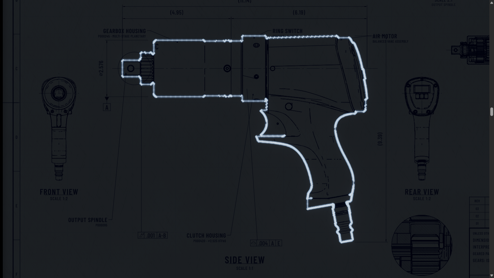
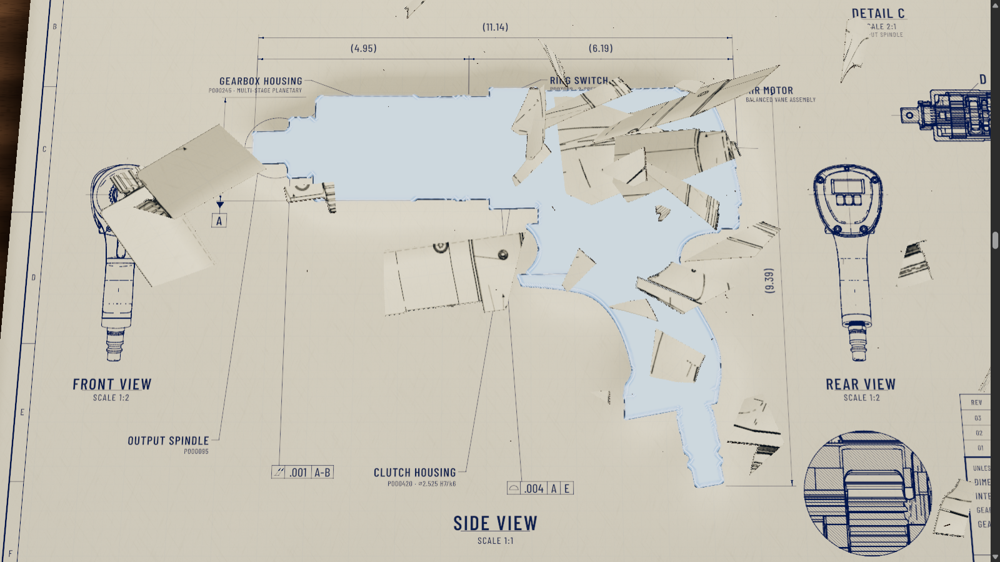
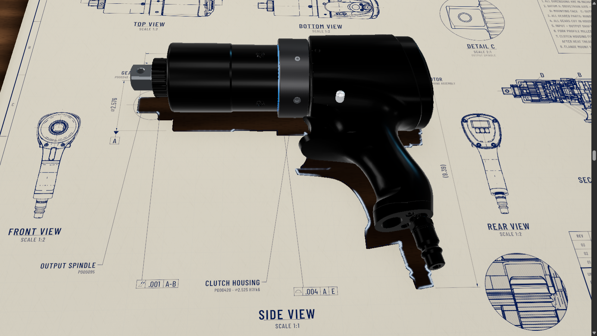

# JG-035 physical paper breakthrough

Owner request: exact-profile light leaking through a real paper barrier; pressure and branching cracks; thick fragments clear before the machine emerges; permanent charred profile hole. Previous handoffs are historical context. No commit, push or deployment requested.

## Implemented behavior

- Storm .45–.58 and dark anticipation .58–.66 retained. Profile hairline light .66–.79 stays lit while pressure builds .79–.84. Aperture growth follows pressure; branch brightness releases with fracture.
- Opaque sheet exterior is the rectangle minus the actual hole, triangulated and clipped to a grid with maximum 4 mm edges. No discarded boundary cells or translucent stock. Profile departure is at most 0.351658 mm.
- Fracture .84–.88 launches 99 direct-extruded pieces, including tiny perimeter chips retained to conserve stock. Thickness 0.45 mm; fronts carry printed strokes/fills. Motion is deterministic in scroll, with different signed spins and velocities.
- Opening clears at .88; PBR emergence starts .89 and finishes .91. Registered model orientation stays constant during translation; camera supplies the rotation. This prevents a cleared vertex rotating back through the barrier.
- Permanent outward charred rim, residual patchy glow, hole visible behind the lifted machine. Sheet opacity remains 1. Perforated sheet holds through global .18, then physically retires .18–.22.
- Reduced motion parks the intact lit drawing at .38. Lite retains the physical sequence with 45% flex amplitude.

## Current proof

- `npx vitest run --maxWorkers=1`: 184/184 tests across 17 files. [Unit log](unit-tests.log).
- Production build passes; existing bundle-size warning remains. [Build log](build.log).
- B1/B2 synthetic contract 29/29; Stage 2 contract passes: 7 named roots and 7 CAD anchors.
- [Desktop/narrow capture report](verified-capture/summary.json): both PASS, zero browser/shader errors. Includes paused stills, reverse transforms, and motion recordings.
- Hole area 0.02696087 m²; fragment area error 1.39e-17 m². Actual near-barrier transformed vertices outside hole: 0 during emergence in both viewports. Opacity 1 throughout.
- Capture desktop changed from full to lite before crack; narrow remained full. Do not relabel the desktop capture as full-tier proof.
- [Full roster](verified-roster/summary.json): 6/6 PASS, completed 2026-10-02 00:43 America/New_York. Desktop/narrow full, both reduced, and both forced-lite cases have zero failures and browser errors. Includes forward/reverse, exact paused boundaries, barrier checks, registration, physical sheet retirement and assembled handoff. Full/lite flex comparison passed.
- Fresh independent source/evidence review: SHIP, no blocking findings. Reviewer did not run a separate browser; runtime evidence was independently captured by the parent. Both review caveats are addressed: this packet identifies superseded red diagnostic folders, and the final narrow-lite case passed.

## Review media

[Desktop motion](verified-capture/desktop/breakthrough.webm) · [Narrow motion](verified-capture/narrow/breakthrough.webm)

## Review boundaries

Implementation and technical verification are complete; owner visual acceptance remains open. Printed strokes and filled symbols travel with fragments; raster fragment print does not reproduce Troika lettering. This limitation is retained in the handoff.

Earlier `preview-first`, `preview-translation`, `raster-desktop`, `quick-first`, `final-capture`, and `full-roster` are diagnostic iterations. They include actual failures and superseded meshes/shaders; use `verified-capture` and `verified-roster` for the final candidate.
