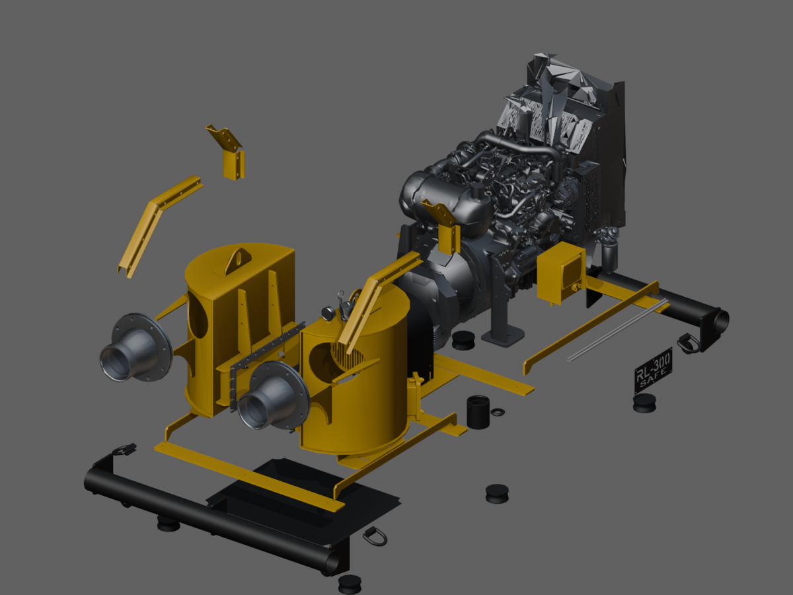
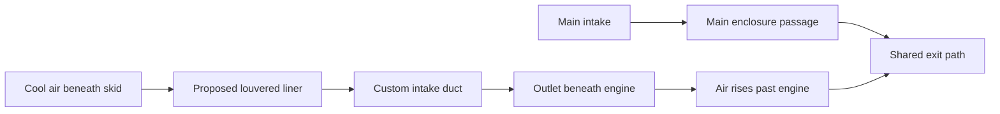

# RL300 owner comments — assessment and revised direction

2026-09-09. Planning/model review only. The [main plan](rl300-the-quiet-machine-plan.md) has been revised; implementation still awaits approval.

## My recommendation

**Make the proposed bottom intake a major reveal.** It gives the sequence a second source of motion, a reason for the camera to descend beneath the enclosure, and a clear connection between the skid, liner, engine, and exhaust. It also presents your design thinking: this portfolio can show where the assembly is going, as well as its current form.

I recommend real, lightweight 3D geometry for the new liner openings and custom duct, supplemented by a selectively sectioned or translucent duct during explanation. That will hold up as the camera moves. A purely screen-space arrow would communicate direction, but would lose the opportunity to make the proposed structure itself visually impressive.

Show the supplies separately before combining them. Establish the main intake; descend for **“A second breath”**; follow the new supply upward; then pull back for **“Two feeds. One exit.”** Distinguish the lower supply initially with a brighter ice-blue core and staggered activation, then let both routes warm and converge. Avoid giving two cool streams radically different heat-map colors merely to distinguish them.

## Response to the three comments

**1. Document length:** agreed. The old “shorten RL300 if compatibility is difficult” fallback has been removed. RL300 should get the length its shots need. Every extension must include before/after layout measurements, timing dependencies, and specific JGUN correction recommendations. Existing normalized whole-page percentages must not silently retime the wrench.

One distinction matters: increasing total page height necessarily changes raw `scrollY / totalScrollableHeight` at the same physical position. We can preserve JGUN's physical scroll duration and its authored animation percentages by separating that raw page statistic from narrative progress. That is the recommended correction, rather than changing the duration of the JGUN sequence. A raw browser scrollbar position and an authored animation percentage are different quantities.

**2. Alternate geometry and airflow:** agreed. The revised plan permits a proposed enclosure design, including openings, liner construction, intake duct, and alternate passages. The new geometry must agree with the path shown on screen; it does not have to agree with the current production geometry. A small “Proposed lower intake” caption supplies context without turning the experience into a disclaimer. No flow simulation or cooling-performance verification was performed here.

**3. Lighting/background freedom:** agreed. My previous plan treated the current JGUN rendering as too fixed. Its lighting, background, and visual effects are now explicitly open to the subsequent visual pass. Keep functional/timing regression checks; stop treating intentional changes to placeholder lighting as failures. Shared rendering infrastructure should support both sections' eventual art direction.

## What the named Blender file contains

Opened `C:/Projects/CAD/RL300-SAFE/RL300-SAFE-photoreal.blend` in Blender 5.1.1 background mode with automatic script execution disabled. Inspected source geometry and evaluated geometry, and rendered diagnostic views without saving the Blender file.

| Item | Verified result |
|---|---|
| File | 9,877,496 bytes; on-disk last-write time reported as 2026-09-07 22:53:21 by this host |
| Scene | Metric, unit scale 1.0; 578 objects, 552 mesh objects |
| Geometry count | 919,668 triangles from source object polygon counts, before modifiers; not an evaluated/rendered triangle budget |
| Named liner | Exact match: `V2RL300-SAF-1047-5`, parent `COMPOSITE_PANELS` |
| Liner dimensions | Approximately **755.65 × 603.26 × 3.044 mm** |
| Liner position | Blender world X −.37782→+.37782 m, Y −1.05224→−.44898 m, Z .15160→.15464 m |
| Liner material | `MSP_BLACK_CHASSIS` |
| Liner geometry | 128 vertices / 108 source faces; 30 evaluated faces after `PANEL_PLANAR` decimation |
| Related panels | `V2RL300-SAF-1047-3` and `-4` exist with the same nominal dimensions at other longitudinal positions |
| Current intake helper | `DUCT_INTAKE_AIRWAY`, hidden from render; a coarse 16-vertex volume under `DUCT_INTAKE` |
| Material detail | Bevel shader nodes are present across the engineering materials; cast aluminum also has procedural noise/bump. No photographic texture images were present: only Render Result and Viewer Node image datablocks. |
| Modifier inventory | 154 Decimate modifiers and four Subdivision Surface modifiers across the scene |

**The key finding: the specified liner is currently a solid plate, not a modeled louver field.** Its vertices occupy only two local Z levels, the isolated render shows a solid surface, and a 36×24 downward ray grid produced 856 hits out of 864. All eight misses were at the corner reliefs; no interior grid samples passed through. The finite ray grid alone would not exclude a tiny opening, but the combined geometry and render evidence does not show the proposed louvers in this saved mesh.

This is useful rather than blocking: it identifies precisely where the presentation derivative should introduce the louver geometry. The inspection does not determine whether a more detailed or newer version exists elsewhere, or in your current unsaved modeling session.

The file uses **Blender Z-up**. The website's Y-up export convention must be mapped explicitly before placing the lower duct or flow curves. The named liner sits low in the assembly; nearby geometry includes transverse floor-track structure, side stiffeners, and two small members crossing its footprint. Their bounds establish neighboring parts, not a collision-free duct route. The intake routing should be authored around them or redesign those presentation parts deliberately.

This context image intentionally hides the shell and most panel/chassis geometry. Visible detached-looking brackets are part of the chosen diagnostic subset, not proof that the saved assembly is disconnected. It is a Workbench geometry view, not a photoreal render or finished concept. The internal equipment supplies useful shapes for a close camera, but the many decimation modifiers mean the chosen engine close-up should be checked for facets and damaged silhouette before final export.

The file is a useful starting point, not automatically a browser-ready asset. Test the procedural finish through export. Where Blender-only shading detail does not survive, bake selected normal/roughness detail or recreate the material response in the web renderer. Do not assume a file named “photoreal” will look the same when loaded as GLB.

## How I would model and reveal the concept

1. Use the existing liner as a registration surface, then author real louver apertures and visible sheet thickness in a new derivative. Keep the source part number in its metadata.
2. Add a shallow lower collection volume and a legible custom duct leading to the under-engine outlet. Final routing, cross-section, and outlet placement are design work; the current inspection does not establish dimensions or airflow effectiveness.
3. Let a floor-level lighting cue introduce the lower supply. The camera descends and the skid/liner cut opens just far enough to reveal the new route. Reveal the duct as solid metal first, then section one face while the streams enter.
4. Track air out below the engine and upward along its form. Use the exposed machinery and duct as depth references; the stream should appear to occupy space, not lie over the render.
5. Ease wider so both supplies and their shared exit are understandable together. The combined flow should read as a designed system, not a cloud of independent particles.

The most valuable prototype addition is a rough but spatially correct lower-intake blockout, alongside the exterior-to-section shot. It will test whether the underside camera and proposed geometry actually communicate the idea before detail modeling. This prototype remains behind the plan approval gate.

## Background and subsequent JGUN recommendations

I inspected [Oryzo](https://oryzo.ai/) in the browser. Its opening places the product on a wood desk and green cutting mat, with tools, contact shadows, and shallow-depth cues. The lesson is that the background establishes a physical world and helps explain the object. My visual review here covers the opening and its initial scroll movement, not an exhaustive audit of every Oryzo section.

For this portfolio, use an original **precision workshop → airflow test chamber** direction:

- **JGUN later:** replace the placeholder background with a measured workshop setting suited to the existing drawing and mechanical choreography. Use a work surface, distant fixtures, and controlled light shapes to give scale and depth. They must stay clear of the gear ladder, LCD, and annotations.
- **JGUN later:** retune key/fill/rim balance for readable machined steel, dark handle, and LCD; use material roughness and reflections to separate parts. Plan the drawing-to-3D lighting evolution inside the current timing windows.
- **RL300:** expand into a larger test-chamber environment. Light banks, deep side walls, floor contact, and localized atmospheric cues establish a larger machine. During the bottom-intake reveal, the floor-level light and cutaway support the source of the air. The enclosure remains the focal object.
- **Shared transition:** connect the environments through color, light direction, and depth; avoid an unrelated background swap. Develop the visual connection within the existing JGUN handoff timing, with additional travel allocated to RL300 if needed.
- **Timing corrections:** decouple narrative progress from total document height; synchronize HUD, navigation, camera, and stage ownership; refresh mappings after resize or direct navigation. Record exact affected consumers during implementation and verify JGUN's duration and authored ranges remain unchanged.

Stronger glow, heat distortion, volumetric light, and section-edge effects are available tools. Their success is whether they help the viewer see and feel the machine. I would develop the environment and lighting together with the two-intake reveal, then select effects against those composed shots.

## Backups and change boundary

Backups created before revising the plan; SHA-256 equality checked at creation:

- `C:/Projects/CAD/RL300-SAFE/RL300-SAFE-photoreal.blend.20260909-215316.bak`
- `project/archive/superseded/rl300-the-quiet-machine-plan.md.20260909-215316.bak`

The model still matched its backup after inspection/rendering. No application source, saved model geometry, or saved Blender rendering settings were changed. Diagnostic scripts/images were created; the plan and this assessment document the revised proposal. Future edits to any existing model must receive a fresh verified backup first.
